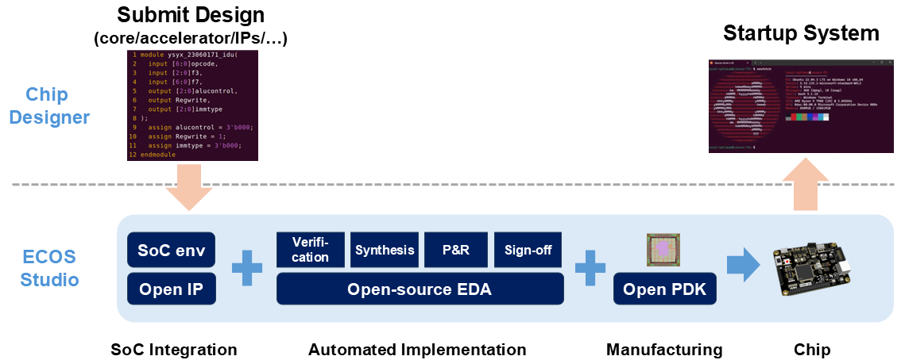

# ECOS Studio: An RTL-to-Chip Silicon Design Solution

[](https://github.com/0xharry/ecos-studio/actions/workflows/lint.yml)

ECOS Studio is an integrated, one-stop silicon design solution that democratizes access to custom silicon. It vertically integrates open-source IP libraries, a robust EDA toolchain, and accessible PDKs into a unified framework, providing an "FPGA-like" experience for ASIC design.



Our goal is to lower the barrier of chip design for researchers, engineers, and students, bridging the gap from RTL design to physical realization.

## Project Structure

This repository is organized into four main components:

### 1. GUI Application (`ecos/`)
Desktop application providing an integrated development environment for chip design.
- **Visual Workspace Management** - Create and manage chip design projects
- **Automated RTL-to-GDS Flow** - One-click execution from Verilog to layout
- **Integrated Tools** - Yosys (synthesis), ECC-Tools (placement & routing), KLayout (visualization)
- See [ecos/README.md](ecos/README.md) for usage guide
- See [ECOS Studio User Guide](ecos/docs/user-guide.md) for detailed documentation

### 2. Open Source IP (`ip/`)
Pre-verified infrastructure for composable design, including configurable SoC templates and common peripherals.
- [retroSoC](https://github.com/retroSoC)

### 3. Open Source EDA (`ecc/`)
**ECOS Chip Compiler (ECC)**: An open-source chip design automation solution that integrates EDA tools (Yosys, ECC-Tools, KLayout) to achieve complete RTL-to-GDS design flow.
- [ECC Documentation](https://github.com/openecos-projects/ecc)

### 4. Open Source PDK (`pdk/`)
Enabling mainstream manufacturing processes.
- [ICsprout 55nm Open PDK](https://github.com/openecos-projects/icsprout55-pdk)

---

**Note:** This is the initial release of ECOS Studio components. We are starting by providing these foundational open-source tools to the community. More subprojects and advanced features will be added in the future. Please stay tuned for updates!

## Download

- [ECOS-Studio v0.1.0-alpha.2 AppImage (amd64)](https://github.com/openecos-projects/ecos-studio/releases/download/v0.1.0-alpha.2/ECOS-Studio_0.1.0_amd64.AppImage)

## Quick Start (For Developers)

```bash
# Setup (init submodules, PDK, and ECC environment)
make setup

# Development
make dev

# Release build (wheels + bundle + AppImage)
make build

# Launch GUI
make gui
```

### CLI Demos

```bash
make demo-gcd           # GCD example
make demo-retrosoc      # retroSoC example
```

For development setup, ecc-tools builds, ecc-dreamPlace builds, wheel builds, and release build details, see [ecos/README.md](ecos/README.md).

## Documentation

- [ECOS Studio User Guide](ecos/docs/user-guide.md)
- [ECOS GUI Development](ecos/README.md)
- [ECC CLI Flow Runner](https://github.com/openecos-projects/ecc/blob/main/README.md#cli-flow-runner)
- [ECC Documentation Index](https://github.com/openecos-projects/ecc/blob/main/docs/index.md)


