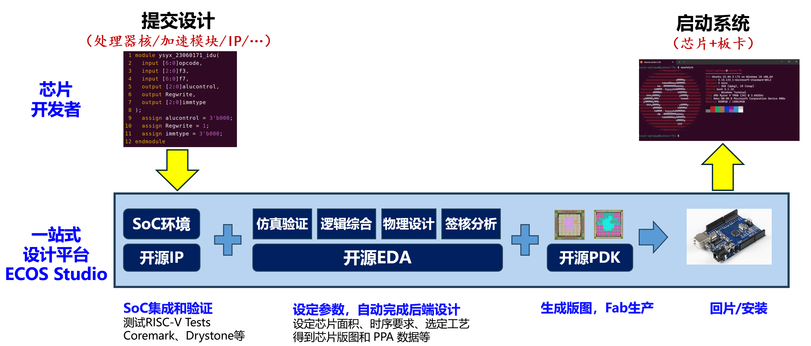

# ECOS Studio: An RTL-to-Chip Silicon Design Solution

ECOS Studio is an integrated, one-stop silicon design solution that democratizes access to custom silicon. It vertically integrates open-source IP libraries, a robust EDA toolchain, and accessible PDKs into a unified framework, providing an "FPGA-like" experience for ASIC design.



Our goal is to lower the barrier of chip design for researchers, engineers, and students, bridging the gap from RTL design to physical realization.

## Project Structure

This repository is organized into three main pillars:

### 1. Open Source IP (`ip/`)
Pre-verified infrastructure for composable design, including configurable SoC templates and common peripherals.
- [SoCExamples](ip/SoCExamples)
- [retroSoC](ip/retroSoC)

### 2. Open Source EDA (`eda/`)
The **ECC** toolchain: a seamless RTL-to-GDSII pipeline optimized for solution maturity and engineering robustness.
- [ECC](eda/ecc)

### 3. Open Source PDK (`pdk/`)
Enabling mainstream manufacturing processes.
- [ICsprout 55nm Open PDK](pdk/icsprout55-pdk)

---

**Note:** This is the initial release of ECOS Studio components. We are starting by providing these foundational open-source tools to the community. More subprojects and advanced features will be added in the future. Please stay tuned for updates!

## Quick Start

Run from the repository root:

```bash
# 1) Initialize submodules, setup ICsprout55 PDK assets, and build ECC CLI
make setup

# 2) Run ECC CLI flow for the GCD demo
make demo-gcd

# 3) Run ECC CLI flow for the SoC example (filelist mode)
make demo-soc

# (Optional) Verify in a clean Docker environment
# gcd only
make docker-verify

# soc only
make docker-verify-soc

# full (gcd + soc)
make docker-verify-all
```

The CLI demos follow ECC's CLI Flow Runner usage (`nix run .#cli -- ...` style):
- [ECC CLI Flow Runner](eda/ecc/README.md#cli-flow-runner)

For GUI usage and more advanced flows/features, refer to ECC documentation:
- [ECC Quick Start (Desktop Application)](eda/ecc/README.md#quick-start)
- [ECC User Guide](eda/ecc/docs/user-guide.md)
- [ECC Documentation Index](eda/ecc/docs/index.md)

